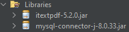

<h1 align="center">Franquia-Hospitais</h1>

## 📖 About the project
This Java program with MySQL integration was developed to streamline the management of hospital franchises. It provides complete control over patients, appointments, doctors, procedures, finances, and report generation, empowering franchise owners to effectively manage all units and enhance the quality of care. It was created as part of the assessment for the Object-Oriented Programming (OOP) course during the third semester of the Analysis and Systems Development (ASD) program.

### Interaction with the Program

We used `JOptionPane` for program inputs.


### JARs

To implement additional program functionalities, we utilized various JAR files, such as:

- `itextpdf-5.2.0.jar` -> (for generating PDF files)
- `mysql-connector-j-8.0.33.jar` -> (for establishing the connection with the MySQL database)



### connectionFactory

To enable the database connection, we created a Java class for connection.


‼️ If you encounter any password mismatch issues with your database, please navigate to the `connectionFactory` class and locate the following line:

```java
properties.setProperty("password", "1234");
```

And change the password to yours password!

## 🦾 Technologies used
<div style="display: flex;">
 


</div>

## 🤔 What I Learned
- I gained expertise in integrating Java and MySQL for database management.
- I learned how to effectively manipulate JAR files to enhance program functionality.
- I acquired the knowledge and skills to generate PDF files through Java code.
- I improved my proficiency in creating and managing relational databases.

## 🧑‍🎓 Authors
- <a href="https://github.com/DevGustavus"> Gustavo Machado Pontes - DevGustavus </a>
- <a href="https://github.com/c-Alvinn"> Álvaro Ríquel Dias - c-Alvinn </a>

## 📋 OOP structure

<details>
<summary>Click to see more</summary><br>

Pessoa
- id
- nome
- endereço
- cpf
- telefone
- login
- senha
- tipoUsuario
- dataCriacao
- dataModificacao

Usuários
- Dono de franquia
- Donos de uma unidade de franquia
- Administrativos
- Médicos
- Pacientes

Dono de franquia (pré-cadastrado)
- Pode modificar o estado de pessoa
- Login diferencia o usuário
- Software só é usado com alguém logado

Médico
- id
- CRM
- pessoa
- especialidade
- dataCriacao
- dataModificacao

Dono de franquia e de unidade podem criar médico
- Apenas 1 especialidade
- Pode trabalhar em qualquer franquia

Franquia
- id
- nome
- cnpj
- cidade
- endereço
- responsável (pessoa já cadastrada)
- dataCriacao
- dataModificacao

Dono de franquia que cria

Unidade de franquia
- id
- franquia
- cidade
- endereço
- responsável (pessoa já cadastrada)
- dataCriacao
- dataModificacao

Dono de franquia que cria

Consulta
- id
- dia e horário
- estado (vazia, agendada, cancelada, realizada)
- médico
- paciente
- valor
- unidade
- dataCriacao
- dataModificacao

Todos fazem. Pacientes só visualizam
- Médico/pacientes conseguem visualizar informações de consulta
- Médico/pacientes conseguem visualizar informações de procedimentos
- Médico visualiza agenda de consulta
- Médico visualiza consultas realizadas por ele próprio

Info Consulta
- id
- consulta
- descrição
- dataCriacao
- dataModificacao

Médico registra informações de consulta
- Médico busca informações de consultas feitas

Procedimento
- id
- nome
- consulta
- dia e horário
- estado (vazia, agendada, cancelada, realizada)
- valor
- laudo
- dataCriacao
- dataModificacao

Procedimento é gerado por consulta ou interesse de paciente
- Médico que faz
- Paciente visualiza

Financeiro Adm
- id
- tipo movimento (entrada, saída)
- valor
- unidade
- descritivo movimento (consulta, procedimento, salário funcionário, energia, água, pagamento franquia, ...)
- dataCriacao
- dataModificacao

Dono de franquia, dono de unidade e administrativos que podem criar
- Cada consulta/procedimento gera entrada para a unidade

Financeiro Médico
- id
- valor
- médico
- estado (agendado, pago)
- franquia
- dataCriacao
- dataModificacao

No dia 1, o software pesquisa consulta e procedimento feitos pelo médico no último mês e registra o montante total pago a ele
- Médico ganha 70% da consulta e 50% do procedimento
- Dono de franquia, dono de unidade e administrativo que faz

Software deve conter calendário para o ano considerado
- Administrativo no dia 1 recebe 1000 reais + 5% do faturamento total da clínica relativo a consultas e procedimentos

Relatórios
Franquia
- Dados financeiros mensais da franquia
- Dados contêm entradas e saídas administrativas
- Saídas de pagamentos ao médico
- Dono de franquia que faz

Unidades
- Dados financeiros mensais das unidades
- Dados contêm entradas e saídas administrativas
- Saídas de pagamentos aos médicos
- Dono de unidade que faz

Consulta e Procedimento
- Relatório de consulta e procedimento de um paciente específico
- Médico e paciente que fazem

Valor Recebido Médico
- Relatório para valores recebidos pelo médico
- Médico que faz

Perfis
- Administrador
  - Todos os privilégios, privilégios de dono de empresa
- Responsável de Franquia
  - Todos os privilégios da franquia
- Responsável de Unidade
  - Todos os privilégios da unidade
- Administrativo
  - Gerencia consultas e procedimentos
- Médico
  - Gerencia consulta e procedimentos

</details>


## 👽 How to clone this project

````bash
    # Select where you want to clone
    $ cd ~/Documents/WHERE_YOU_WANT
````

````bash
    # Clone the project
    $ git clone https://github.com/DevGustavus/REPOSITORY_NAME.git
````

````bash
    # Check if cloning worked fine
    $ cd ~/Documents/DIRECTORY_LOCATION
    $ ls
````
